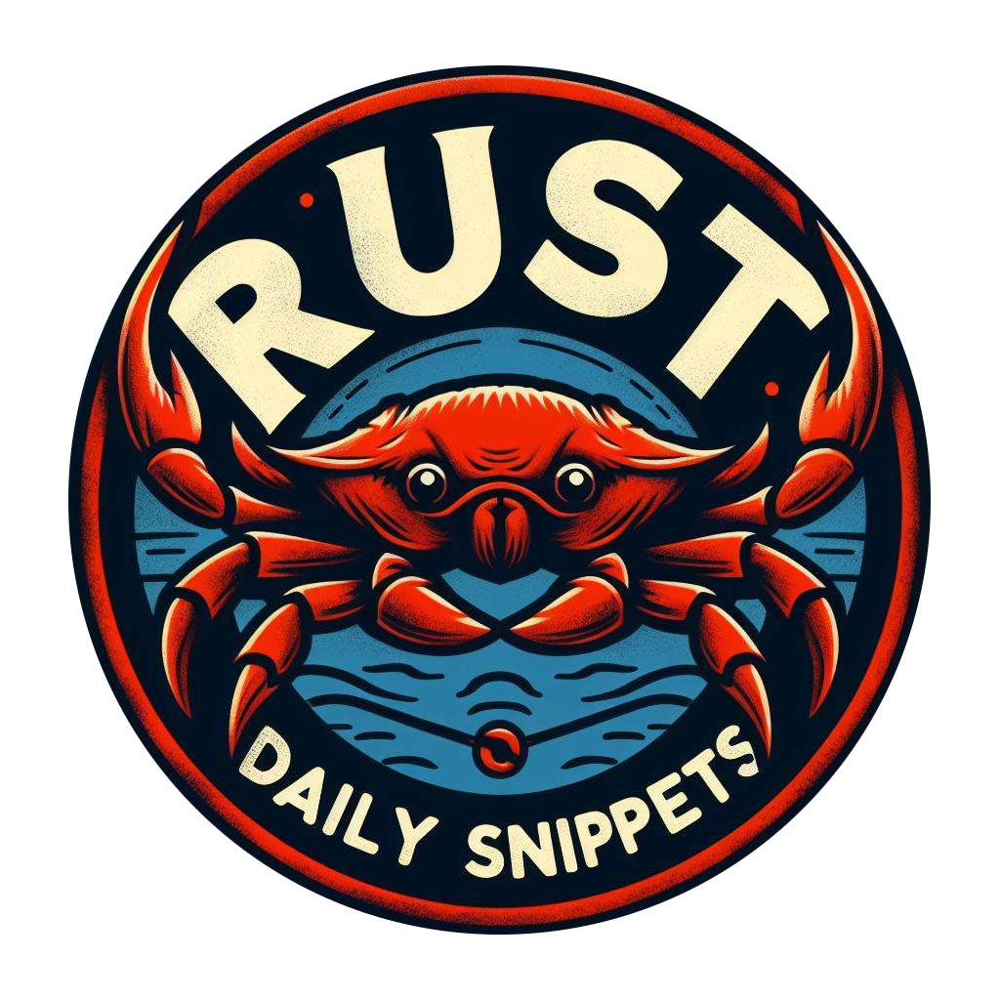

<p align="center">
    
    <h3 align="center">Rust Daily Snippets</h3>
</p>

My daily Rust journey in 'Rust Daily Snippets' a personal repository documenting my progress and projects in Rust programming. From web apps to command-line tools, discover my daily learnings and creations.

Enhancing Rust proficiency through a curated selection of resources:

- the comprehensive Rust eBookshelf, https://dieterplex.github.io/rust-ebookshelf/
- hard copy of 'Programming Rust' by O'Reilly, https://www.oreilly.com/library/view/programming-rust-2nd/9781492052586/

My learning method is straightforward:

1. Absorb knowledge in bite-sized portions daily.
2. Transcribe code by hand using an E-Ink device for tactile learning, reinforcing muscle memory
3. Then transfer it to VS Code once memorized.

## Features

- webapp
  - Actix
  - Axum
- Generics
  - Basic with Ord trait
- Enums
  - Basic with Option trait

## Requirements

- Rust

## How to add new crates

1. Update Cargo.toml members array ie.

```
members = [
  ...
  "crates/your-crates-name"
]
```

2. Run cargo, and add your new crates

```
cargo new crates/your-crates-name
```

## How to run a crates package

Specify the package you want to try. Remove the "crates/" folder

```
cargo run --package your-crates-name
```

## Tech Stack

> Rust only!

## License

[The Unlicense](https://choosealicense.com/licenses/unlicense/)
